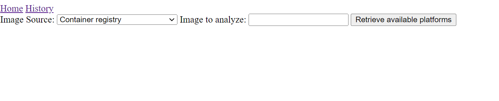
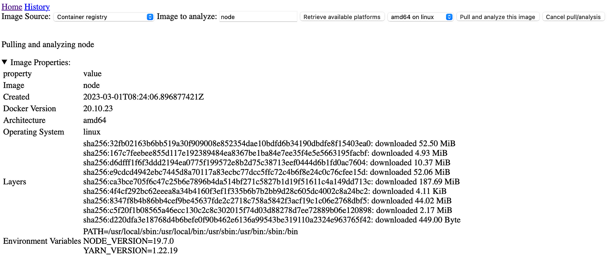
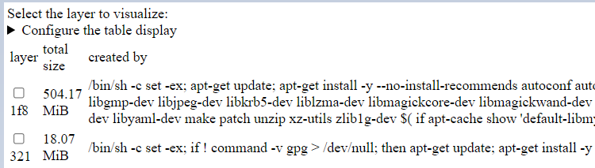
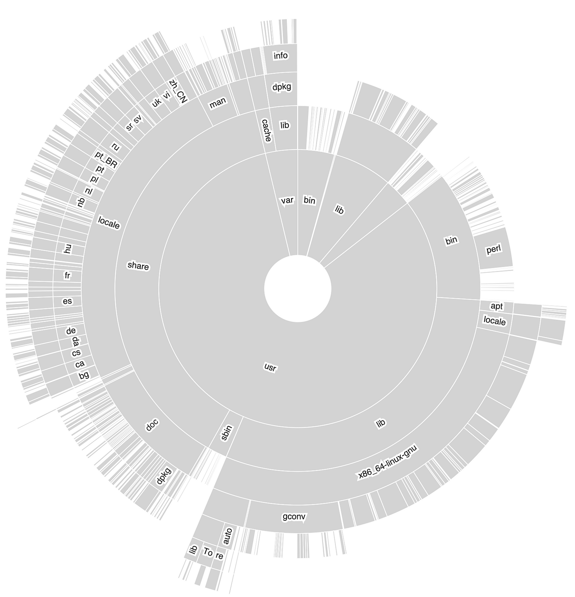
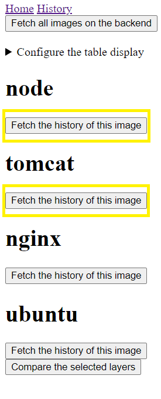
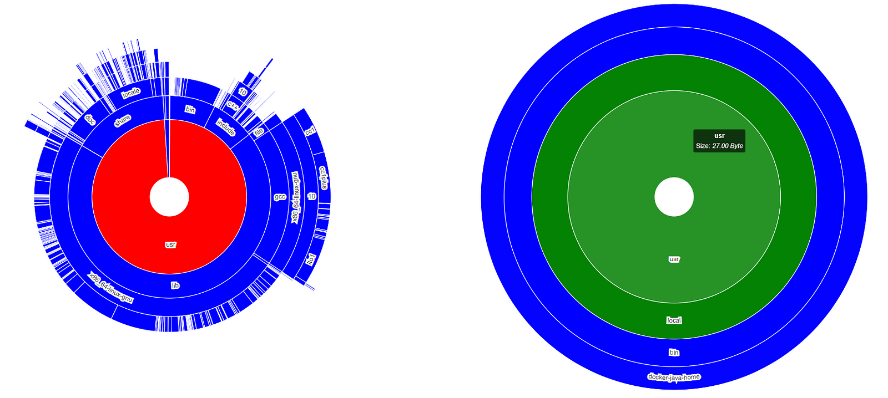
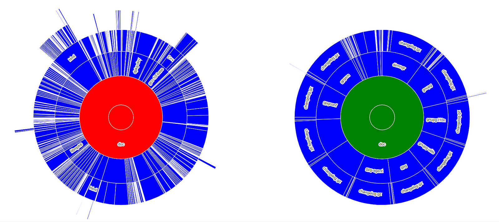

# Container Layer Analyzer

We create and use base images for our applications. So how much do we pay attention to the size of these images when creating them? Why are these images so large? What is the size of each layer in the image on the disk? When we look at images in depth, analyzing them with graphics provides an easier solution. You may click on these images to see how much space they have, especially when comparing two separate layers. There is a container layer analyzer that shows how much space these layers have. This analyzer, created by Dan Čermák, analyzes the layers of one or more images with a simple interface.

# How to Run?
To begin, the frontend, which execute the analysis, is running on the 5050 port, while the backend, which allow us to make comparisons, is running on the 4040 port. Both Docker and Podman are options for running it.

In this article, I will make an example for Docker. The images used here will be used from Dan Čermák’s Github repository.

```
docker run --rm -p 5050:5050 ghcr.io/dcermak/container-layer-sizes:latest
docker run -d -p 4040:4040 ghcr.io/dcermak/container-layer-sizes-backend:latest
```

If you are running them locally, you will see the screen below when you visit http://localhost:5050 . If you are running on a different server, you can check by typing the port with that server ip.



In the “Image to analyze:” section, the name of the image you want to be scanned is written.



When the “Pull and analyze this image” button is clicked, the image is pulled and analyzed. The “Image Properties” section shows the image properties.



Clicking on the desired layer and the "Plot this layer" button creates an image.




If this image has to be compared to another image, it is saved to the backend running on port 4040.


When you go to http://localhost:4040, you can see which images are saved as a json.


Secondly, the same steps are repeated for the "tomcat" image and saved in the backend.
To compare the images, click the "History" button at http://localhost:5050 and all images found in the backend are listed.


Here, the desired layers for "node" and "tomcat" are selected.



And finally, click the "Compare the selected layers" button.



In this way, the two layers are compared.
The meaning of the colors in the chart:
- green: The file or directory in this image is smaller than the one in the other.
- red: The file or directory in this image is larger than the one in the other.
- yellow: This directory or file is the same size as the other image
- blue: this file or directory exists only in this image.
In addition, when a directory or file is clicked in the graphic, it focuses on that same directory or file in the other image.

