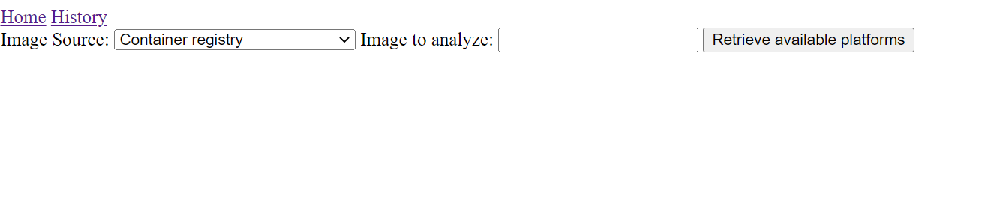
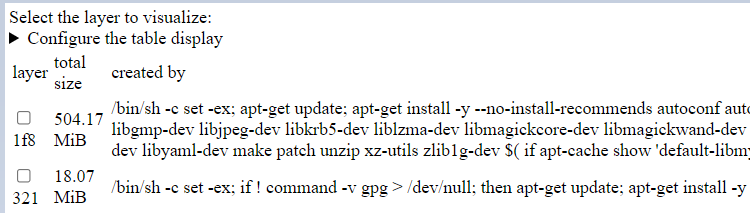
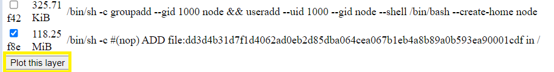
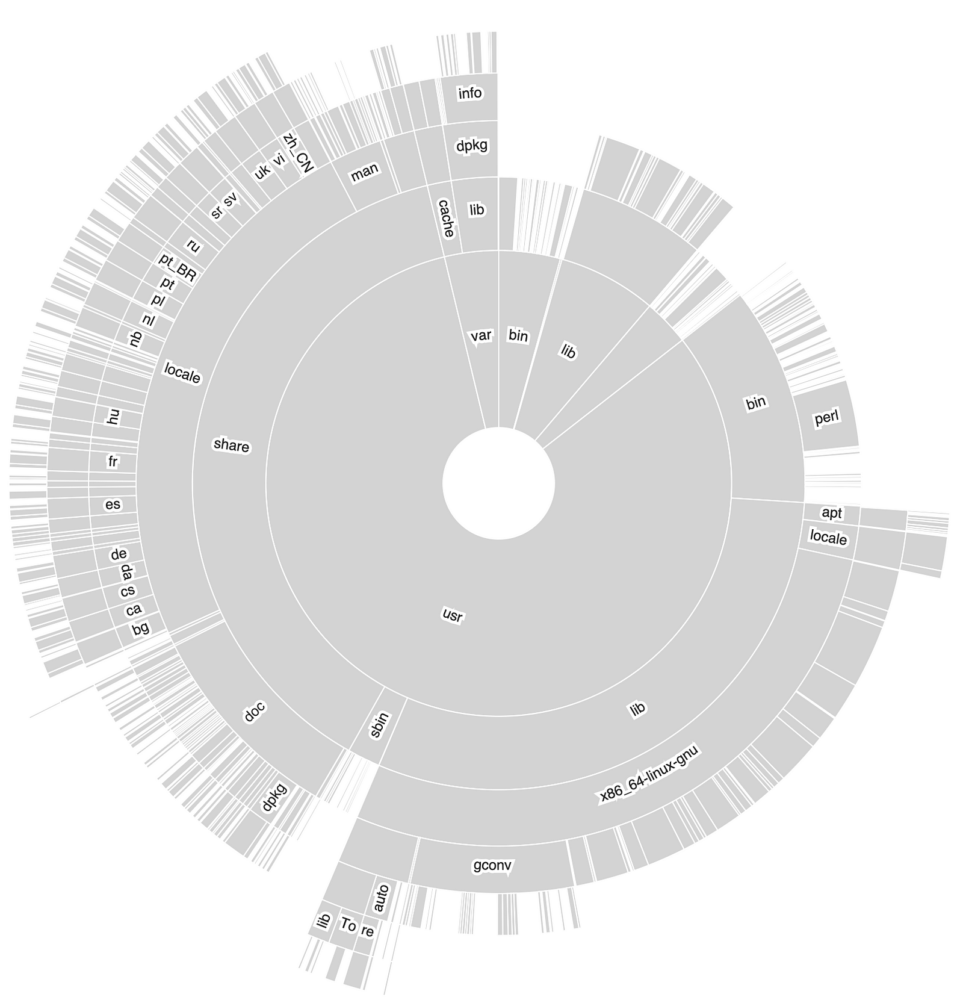
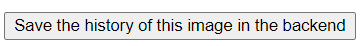
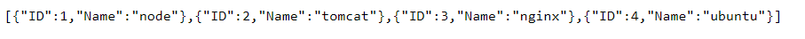
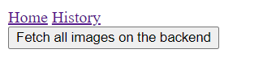
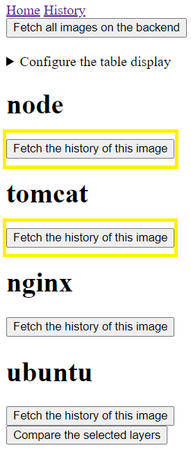
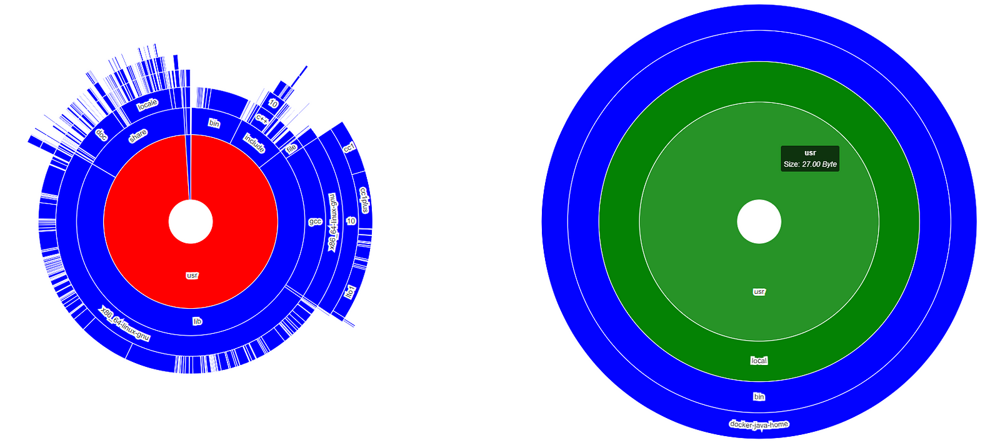
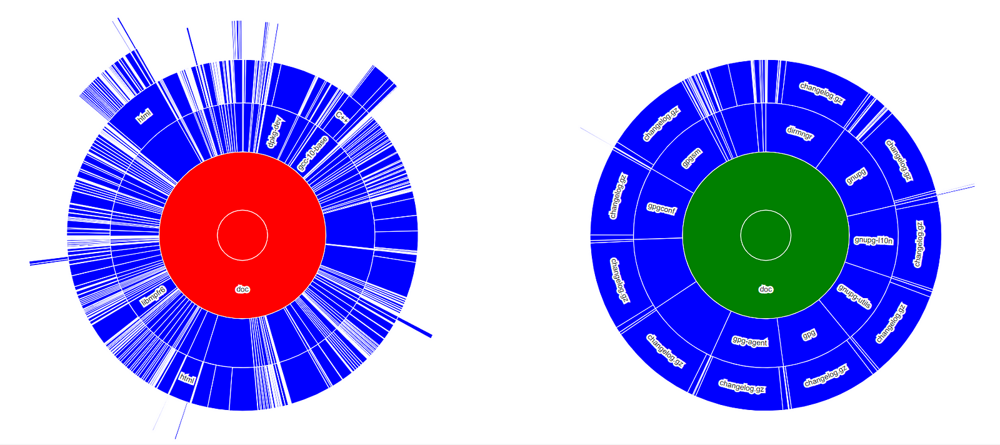

# Container Layer Analyzer

Uygulamalarımız için base imajlar oluşturup kullanıyoruz. Peki bu imajları oluştururken boyutlarına ne kadar dikkat ediyoruz? Bu imajların boyutları neden bu kadar büyük? Imaj içerisinde bulunan her bir layerın boyutu diskte ne kadar yer kaplamakta? Derinlemesine bakıp incelerken görsellerle analiz edip görmek daha iyidir. Özellikle farklı iki layerı karşılaştırırken bu görsellere tıklayarak ne kadar boyuta sahip olduklarına bakılabilir. Bu layerların ne kadar yer kapladığını görselleştirerek sunan bir container layer analyzer var. Dan Čermák'ın oluşturmuş olduğu bu analyzer, basit bir arayüzle bir veya birden fazla imajın layerlarını analiz eder.

# Nasıl Çalıştırılır?
Öncelikle, analiz yapacak olan frontend 5050 portunda çalıştırılır, daha sonra ise karşılaştırmalar yapmamızı sağlayacak olan backend ise 4040 portunda çalıştırılır. Podman ile çalıştırılabileceği gibi Docker ile de çalıştırılabilir.

Bu kullanımda Docker için örnek yapacağım. Burada kullanılan imajlar Dan Čermák'ın Github reposundan kullanılacaktır.

```
docker run --rm -p 5050:5050 ghcr.io/dcermak/container-layer-sizes:latest
docker run -d -p 4040:4040 ghcr.io/dcermak/container-layer-sizes-backend:latest
```

Eğer lokalinizde bunları çalıştırıyorsanız http://localhost:5050 adresine gittiğinizde aşağıdaki gibi bir ekran sizi karşılar. Farklı bir sunucuda çalıştırıyorsanız o sunucu ip si ile portu yazarak bakabilirsiniz.



"Image to analyze:" kısmına taranmasını istediğiniz imaj adı yazılır.


Pull and analyze this image butonuna tıklandığında imaj pull edilip analiz edilir. Imajla ilgili özellikler de Image Properties kısmında görülür.



Görüntülenmesi istenilen layera tıklanır ve Plot this layer butonuna tıklanıldığında görsel oluşturulur.





Eğer bu imaj başka bir imaj ile karşılaştırılacaksa 4040 portunda çalışan backend e kaydedilir.



http://localhost:4040 adresine gidildiğinde json olarak hangi imajların kaydedildiği görülür.



İkinci olarak ise "tomcat" imajı için aynı adımlar tekrarlanır ve backend e kaydedilir.
İmajları karşılaştırmak için http://localhost:5050 'de bulunan History e tıklanır ve backend de bulunan tüm imajlar listelenir.



Burada "node" ve "tomcat" için istenilen layerlar seçilir.



Ve son olarak Compare the selected layers butonuna tıklanır.



Bu sayede iki layer karşılaştırılmış olur.
Grafikteki renklerin anlamına gelecek olursak:
- yeşil: bu dosya ya da dizin diğer imajda bulunandan daha küçüktür.
- kırmızı: bu dosya ya da dizin diğer imajda bulunandan daha büyüktür.
- sarı: bu dosya ya da dizin diğer imajda bulunanla aynı boyuta sahiptir.
- mavi: bu dosya ya da dizin yalnızca bu imajda bulunmaktadır.
Ek olarak, grafikte bir dizine ya da dosyaya tıklanıldığında diğer imajda da bu dizin ya da dosya varsa ona odaklanır.



