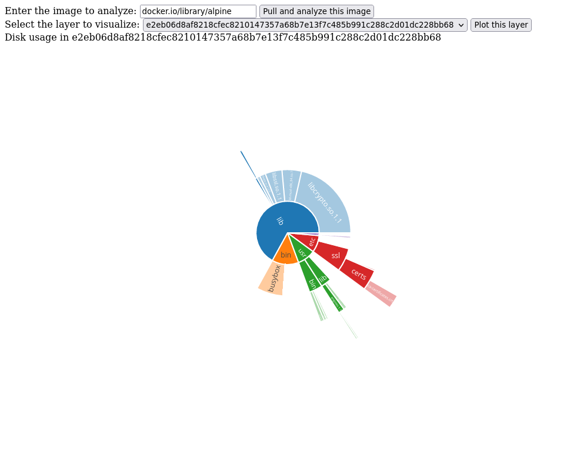
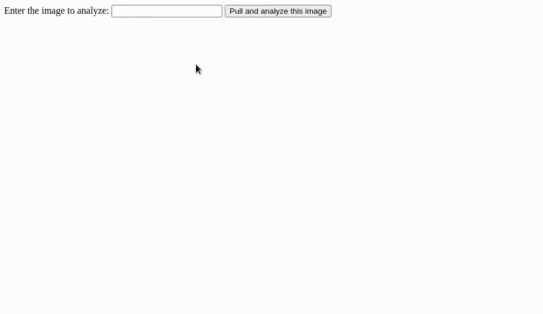

# Container Layer Analyzer

Have you ever wondered what exactly is eating up your precious space in each
layer of your container images? Would you like to have a nice visualization of
the file system similarly to what
[Baobab](https://wiki.gnome.org/Apps/DiskUsageAnalyzer) provides?

In that case this is the tool you are looking for: it provides a simple web UI
that shows you the size of your file system inside any publicly accessible
container:


[](https://app.fossa.com/projects/git%2Bgithub.com%2Fdcermak%2Fcontainer-layer-sizes?ref=badge_shield)



## Run it

To run this on your local machine, you'll need the following tools:

- [podman](podman.io/) configured to work in rootless mode
- node.js and yarn
- golang
- the prerequisites to build `github.com/containers/image` (see
  [here](https://github.com/containers/image#building))


When you have these tools set up, clone the repository and run:
```ShellSession
$ git clone https://github.com/dcermak/container-layer-sizes.git
$ cd container-layer-sizes.git
$ yarn install
$ yarn run build
$ ./container-layer-sizes
```

The web UI is then accessible on [localhost:5050](http://localhost:5050/).


## What is missing?

- proper documentation
- better tests
- actual error handling and better feedback via the UI
- performance improvements
- support local images


## How does this work?

The go binary is a simple web server that serves the frontend code and analyzes
the container sizes. The size analysis works as follows:

1. The requested container image is pulled from a registry into the local
   container storage (i.e. the equivalent of `podman pull`). The image is then
   extracted into a temporary directory. This gives us each layer as an archive.

2. Each layer is analyzed using the
   [archiver.Walk()](https://pkg.go.dev/github.com/mholt/archiver#Walk) function
   and the whole directory tree is saved in a `Dir` struct (see
   ). The resulting structures are converted to json and
   sent to the frontend.

3. The frontend code receives the data from the backend and has to perform some
   conversion so that the data can be visualized as a sunburst chart via
   [plotly](https://plotly.com/javascript/sunburst-charts/).
   Currently we also cut of paths that are deeper than five subdirectories, as
   otherwise the frontend page becomes very sluggish.


## FAQ

1. Should I run this in production?

Absolutely not! There is no logging, no cleanup and no security audit has been
perform. Please only run this for testing on your local machine for now.


## License
[](https://app.fossa.com/projects/git%2Bgithub.com%2Fdcermak%2Fcontainer-layer-sizes?ref=badge_large)