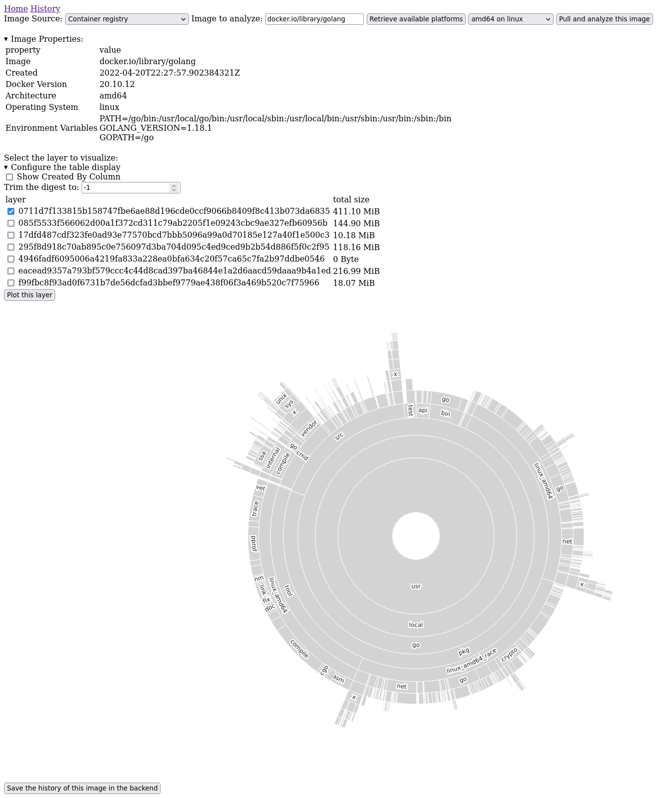
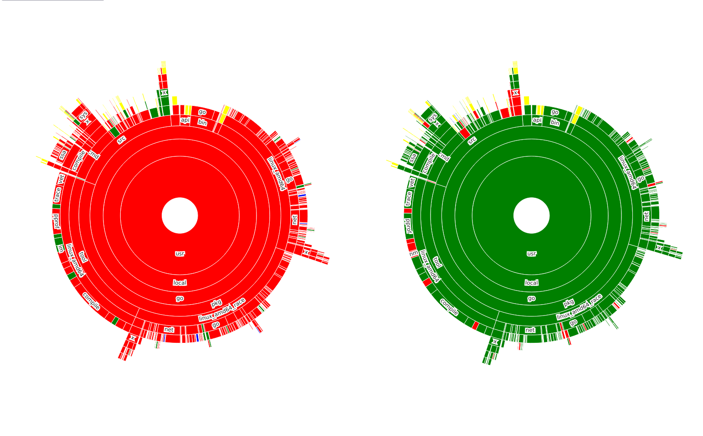

# Container Layer Analyzer

[](https://github.com/dcermak/container-layer-sizes/actions/workflows/backend.yml)
[](https://github.com/dcermak/container-layer-sizes/actions/workflows/frontend.yml)
[](https://github.com/dcermak/container-layer-sizes/actions/workflows/container.yml)

Have you ever wondered what exactly is eating up your precious space in each
layer of your container images? Or what changed between a rebuild of your
container image? Would you like to have a nice visualization of the file system
similarly to what [Baobab](https://wiki.gnome.org/Apps/DiskUsageAnalyzer)
provides?

In that case this is the tool you are looking for: it provides a simple web UI
that shows you the size of your file system inside any container image that can
be pulled from a registry or imported from a local archive:



Additionally, it allows you to save an image into a backend database and compare
it to any other layer from any other image:



The colors in the comparison graph have the following meaning:
- green: this folder or file is smaller than in the other image
- red: this folder or file is larger than in the other image
- yellow: this folder or file has the same size
- blue: this folder or file is only present in this image

Additionally, clicking on a folder or file in the sunburst graph will focus the
same folder or file in the compared image:


## Run it

The application is available as two containers from `ghcr.io`. You can fetch and
run them on your local machine via:

```ShellSession
❯ podman run -d -p 4040:4040 ghcr.io/dcermak/container-layer-sizes-backend:latest
d9d67a66d4ce3473c646440b966e7d2a1b3d8c56e013b5eab985c53631ca5abd
❯ podman run -d --rm -p 5050:5050 ghcr.io/dcermak/container-layer-sizes:latest
6537a951423aeee3c6559e5dd8b76011ec8148023b43be4edf1ce09fe2c2dce3
```

Then open [localhost:5050](http://localhost:5050/) in your browser and give it a
spin.


## Build it directly on your machine

To build the analyzer on your machine, you'll need the following tools:

- [podman](podman.io/) configured to work in rootless mode
- node.js and yarn
- golang
- the prerequisites to build `github.com/containers/image` (see
  [here](https://github.com/containers/image#building))


When you have these tools set up, clone the repository and run:
```ShellSession
❯ git clone https://github.com/dcermak/container-layer-sizes.git
❯ cd container-layer-sizes
❯ yarn install
❯ yarn run build
❯ go run ./bin/storage &
Ready. Listening on :4040
❯ go run ./bin/analyzer
Ready. Listening on :5050
```

The web UI is then accessible on [localhost:5050](http://localhost:5050/).


## Build it with Docker or Buildah

You can build the container image that is available on `ghcr.io` locally as well
via docker or buildah:
```ShellSession
$ docker build .
$ buildah bud --layers .
```


## What is missing?

- proper documentation
- better tests
- actual error handling and better feedback via the UI
- performance improvements


## How does this work?

The go binary is a simple web server that serves the frontend code and analyzes
the container sizes. The size analysis works as follows:

1. The requested container image is pulled from a registry into the local
   container storage (i.e. the equivalent of `podman pull`). The image is then
   converted into an oci archive and extracted into a temporary directory. This
   gives us each layer as an archive.

2. Each layer is analyzed using the
   [CompressedArchive.Extract()](https://pkg.go.dev/github.com/mholt/archiver/v4#CompressedArchive.Extract)
   function and the whole directory tree is saved in a `LayerSizes` struct (see
   ). The resulting structures are converted to json
   and sent to the frontend.

3. The frontend code receives the data from the backend and has to perform some
   conversion so that the data can be visualized as a sunburst chart via
   [sunburst-chart](https://github.com/vasturiano/sunburst-chart).


## FAQ

1. Should I run this in production?

Absolutely not! There is no good logging, no cleanup and no security audit has
been performed. Please only run this for testing on your local machine for now.

Also, the storage backend has no authentication, so **anyone** with access to
the backend, can store images there.

tl;dr; Just run this on your local machine for testing. You have been warned.
